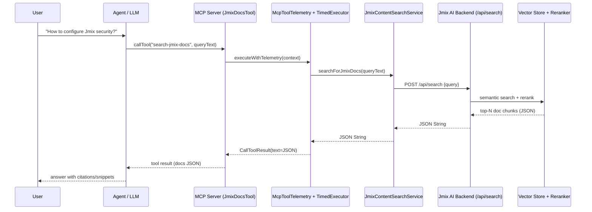

# Jmix Docs MCP Tool

Minimal MCP server exposing a single tool that searches Jmix content (documentation, training examples, UI samples) via an AI backend with vector search and reranking.
The LLM calls this tool with a free-form text query, and the backend finds the most relevant pages from the indexed Jmix knowledge base.
Inside the backend, embeddings and a reranker first collect candidate documents, then filter and sort them so that only truly useful fragments remain in the final result.
The MCP server simply passes this list of documents back to the LLM as JSON, without adding extra logic or modifying the content.


## Flow Overview



## Flow Overview(png)


## MCP Tool

MCP contract (conceptual):

```json
{
  "name": "search-jmix-docs",
  "description": "Search Jmix documentation using semantic search with reranking",
  "input": {
    "type": "object",
    "properties": {
      "queryText": {
        "type": "string",
        "description": "Search query for Jmix documentation"
      }
    },
    "required": ["queryText"]
  }
}
```

## Backend API (internal)

```http
POST /api/search
Content-Type: application/json

{
  "query": "<text>"
}
```

Response: JSON with top reranked Jmix doc chunks (returned as raw String to the LLM).

## Transport

The server supports two MCP transports simultaneously:

| Transport | Endpoint | Status |
|-----------|----------|--------|
| **Streamable HTTP** | `POST /mcp` | Primary (recommended) |
| **SSE** | `GET /sse` + `POST /message` | Backward compatibility |

Streamable HTTP is the default per MCP spec 2025-03-26. SSE is kept for legacy clients and can be disabled via `mcp.server.sse-compat.enabled=false`.

## Development
1. Run [Jmix AI Backend](https://github.com/jmix-framework/jmix-ai-backend)
2. Run Application (`./gradlew bootRun`)
3. Add MCP to project.

**Streamable HTTP (recommended):**

- For Claude Code: `claude mcp add --transport http jmixdocs http://localhost:8080/mcp`
- Config:
```json
{
    "jmixdocs": {
      "type": "streamable-http",
      "url": "http://localhost:8080/mcp"
    }
}
```

**SSE (legacy):**

- For Claude Code: `claude mcp add --transport sse jmixdocs http://localhost:8080/sse`
- Config:
```json
{
    "jmixdocs": {
      "type": "sse",
      "url": "http://localhost:8080/sse"
    }
}
```

## Rate Limiting & Validation

Multi-layer protection via `McpRequestValidator`:
- **Per-IP rate limiting** — 300 req/hour (Bucket4j)
- **Global rate limiting** — 800 req/min (DDoS protection)
- **Token budgets** — per-IP and global limits across minute/hour/day windows
- **Input validation** — max query length 10k chars, max estimated tokens 2k

## Notes

* All retrieval, embedding and reranking logic lives in the AI backend.
* `McpToolTelemetry` + `TimedExecutor` add timing, structured logging and MCP logging notifications around tool calls.


